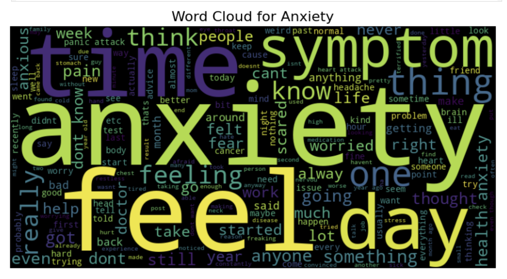
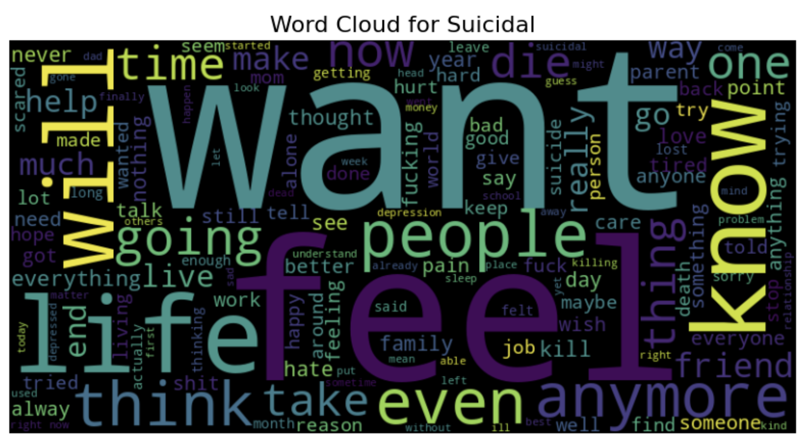

<h1>Sentiment Analysis for Mental Health Classification</h1>

<h2>Introduction</h2>

This project focuses on classifying mental health-related texts into five categories: <strong>Anxiety</strong>, <strong>Depression</strong>, <strong>Suicidal</strong>, <strong>Bipolar</strong>, and <strong>Normal</strong>. By analyzing text statements, we aim to identify key patterns in mental health issues using machine learning models. This project leverages textual data to create a tool that can provide valuable insights into the mental well-being of individuals, supporting mental health monitoring efforts.

<h2>Dataset</h2>
    
The dataset contains various mental health-related text statements, categorized into the following classes:

    <ul>
        <li><strong>Anxiety</strong></li>
        <li><strong>Depression</strong></li>
        <li><strong>Suicidal</strong></li>
        <li><strong>Bipolar</strong></li>
        <li><strong>Normal</strong></li>
    </ul>
    
The dataset includes textual content that reflects different mental health conditions, providing the foundation for model training and classification.

<h2>Project Goal</h2>
    
The primary goal is to build a machine learning model that accurately classifies mental health conditions based on text data. This tool can be useful in early mental health detection, allowing for better mental health interventions. While the model doesn’t replace professional diagnosis, it can help in providing automated insights that guide further mental health evaluations.

 <h2>Workflow</h2>
    <ol>
        <li><strong>Data Preprocessing:</strong> 
            <ul>
                <li>Text cleaning (removing noise, special characters, and irrelevant information).</li>
                <li>Tokenization and vectorization using <strong>TF-IDF</strong> for feature extraction.</li>
                <li>Word Cloud visualization to understand the most frequent words in each category.</li>
            </ul>
        </li>
        <li><strong>Modeling:</strong> 
            <ul>
                <li><strong>Logistic Regression</strong> and <strong>Random Forest Classifier</strong> were implemented as the primary models for classification.</li>
                <li>Model training was performed on the preprocessed text data.</li>
            </ul>
        </li>
        <li><strong>Evaluation:</strong> 
            <ul>
                <li>The models were evaluated using <strong>Confusion Matrix</strong> and <strong>Classification Report</strong> to assess the precision, recall, F1-score, and accuracy of the predictions.</li>
            </ul>
        </li>
    </ol>

  <h2>Methodology</h2>
    <ul>
        <li><strong>Baseline Model:</strong> We began with <strong>Logistic Regression</strong> as the baseline model to establish initial performance.</li>
        <li><strong>Advanced Model:</strong> <strong>Random Forest Classifier</strong> was used for further improvements in classification performance.</li>
        <li><strong>Visualization:</strong> Word clouds were created for each class to visually inspect the most frequent terms in the text data.</li>
    </ul>

  <h2>Conclusion</h2>
    
By using <strong>Logistic Regression</strong> and <strong>Random Forest Classifier</strong>, the project demonstrates how machine learning can classify mental health conditions from textual data. Although simple, these models achieved reasonable accuracy. The models provide a foundation for further exploration into automated mental health monitoring tools.

   <h2>Results</h2>
    
Key performance metrics for the models:

    <ul>
        <li><strong>Accuracy:</strong> X%</li>
        <li><strong>Precision/Recall/F1-Score:</strong> See classification report for detailed performance.</li>
    </ul>
    
Confusion matrix and classification reports are available in the <code>notebooks/</code> folder.

<h2>Contributor</h2>
    <ul>
        <li><strong>Manya Gangoli</strong></li>
    </ul>

 <h2>Contact Information</h2>
    
For inquiries or collaboration, feel free to reach out:

    <ul>
        <li>Email: <a href="mailto:manyagangoli14@gmail.com">manyagangoli14@gmail.com</a></li>
         <li>LinkedIn: <a href="https://www.linkedin.com/in/manyagangoli/">Manya Gangoli</a></li>
 </ul>

</body>
</html>
